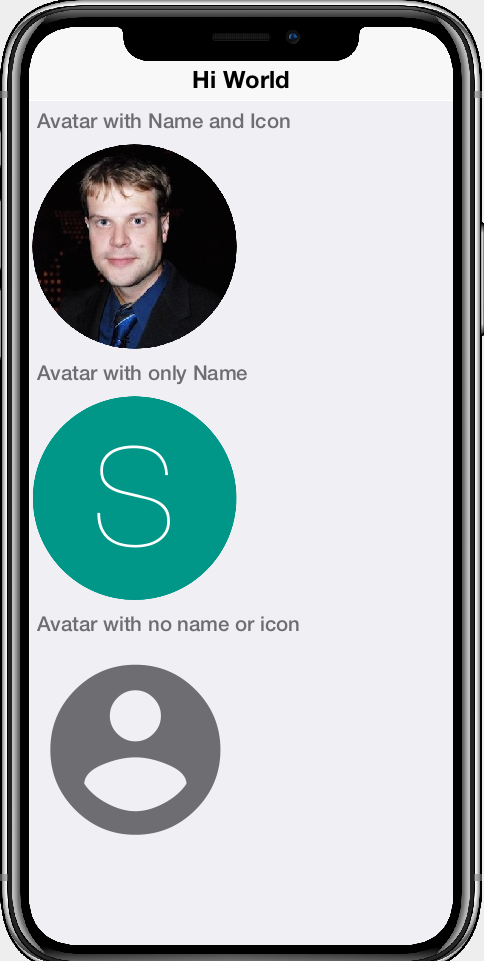
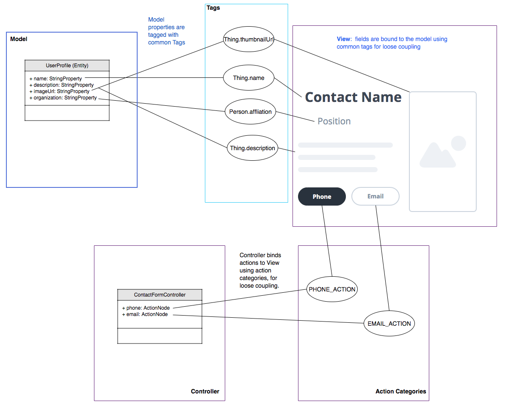
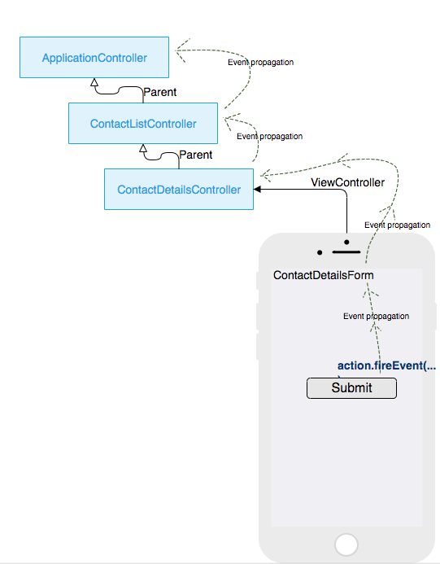

= CodeRAD
Steve Hannah <steve.hannah@codenameone.com>
An MVC, Rapid-Application-Development library for Codename One
:toc:

== Introduction

The CodeRAD project was conceived as a way to make it easier to create richer reusable components for Codename One, and thus enabling more rapid development.  The goal is to provide an exhaustive set of off-the-shelf user interface components that can be easily assembled into professional-looking mobile applications without the need for extensive UI development or design.  Version 1.0 includes a small set of components that were developed as proofs of concept, but we will be adding more components as we go along.

The following is a sample of a few components that have been developed with CodeRAD, and can be used in your Codename One application today:

. https://github.com/shannah/RADChatRoom[RADChatRoom, window=_top] - A full-featured messaging application UI that can be used to add "Chat" capability to your app.
+
image::https://shannah.github.io/RADChatRoom/images/Image-210220-105119.095.png[RADChatRoom,240]
. {@link com.codename1.rad.ui.entityviews.ProfileAvatarView} - Shows an entity's thumbnail image inside a round mask.
+

. {@link com.codename1.rad.ui.entityviews.ProfileAvatarsTitleComponent} - A component that displays a number of {@link com.codename1.rad.ui.entityviews.ProfileAvatarView}s in a "fan" layout (i.e. like BoxLayout.X_AXIS, except that it will "fan them out" with overlap if there isn't enough space for everything).  This is used as the form's title component for the https://github.com/shannah/RADChatRoom[RADChatRoom] component.
+
image::https://shannah.github.io/RADChatRoom/images/Image-210220-020916.612.png[ProvileAvatarsTitleComponent]
. {@link com.codename1.rad.ui.entityviews.ProfileListView} - Displays a list of profile entities with avatar, name, and a customizable set of actions that can be performed for each one.
+
image::https://shannah.github.io/RADChatRoom/images/Image-220220-084136.625.png[ProfileListView,320]

See the {@link com.codename1.rad.ui.entityviews} package for a list of available components, although this list wouldn't include 3rd-party components that use CodeRAD as a dependency (e.g. https://github.com/shannah/RADChatRoom[RADChatRoom, window=_top]).

[NOTE]
====
**What makes these components different than the core Codename One components?** 

These components use CodeRAD's loose-coupling which allows you to use them with a variety of view models. Changing the view that you use to render your model is often a matter changing a single line of code since you can reuse the same model between them.

Read the rest of this overview to learn more about CodeRAD, and how it will change how you develop Codename One applications.

====

=== The Problem (Why do we need CodeRAD?)

Codename One provides a comprehensive set of UI components (e.g. buttons, text fields, select lists) that can be composed together to create rich, mobile user interfaces.  However, it requires a great deal of skill to stitch these components together in a way that results in a rich user experience.  In addition to familiarity with the available components, developers must posess a solid understanding of core concepts like layout managers, events, component life-cycles, animation managers, transitions, and styles, as well as a myriad of component settings to make them behave just so, for the context at hand.

Codename One provides a number of tools to assist developers in their UI development, including GUI builders, CSS support, themes, samples, and project templates, but creating a polished user interface still requires a lot of time and focus to get things"just right".  Most software developers aren't designers.  We'd prefer to start with a nice design, and just "plug it in" to our application models.

=== How CodeRAD Solves this Problem

CodeRAD employs the MVC (Model-View-Controller) design pattern in a unique flavour which is tailored specifically for Codename One applications.  It provides a method of loose coupling that allows view classes, model classes, and controller classes to be written without any explicit dependencies on each other, which allows each to be reused across multiple applications, and shared with other developers.  View components can be bound at runtime with any model component that meets the view's requirements to provide a rich user experience out of the box.  

Rather than tinker with low-level widgets, layouts, and styles, the developer just plugs values into the "view model", and changes are bound directly to the view.  As you'll see, views are extremely versatile and extensible, while not requiring any direct, low-level UI component manipulation.  

[NOTE]
====
As a first proof of concept, we've developed `ChatRoomView`, a rich user interface component for developing a messaging application. 

.The `ChatRoomView` component is the first in a new breed of rich UI components built on CodeRAD
image::https://shannah.github.io/RADChatRoom/images/Image-210220-105119.095.png[ChatRoomView,320]

Try out the https://shannah.github.io/RADChatRoom/demo/[demo application] right in your browser. 

Read the https://shannah.github.io/RADChatRoom/getting-started-tutorial.html[getting started tutorial] to see how easy it is to incorporate this component into your application.
====

== Fundamental Concepts

There are just a few fundamental concepts required to start using CodeRAD to accelerate your development.

. https://en.wikipedia.org/wiki/Model%E2%80%93view%E2%80%93controller[MVC (Model-View-Controller)] - A design pattern employed by CodeRAD which is used for developing user interfaces which divides the related program logic into three interconnected elements
+
image::https://upload.wikimedia.org/wikipedia/commons/thumb/a/a0/MVC-Process.svg/200px-MVC-Process.svg.png[]
. *Entities* - CodeRAD introduces `Entity`, a base class for "model" classes.  This includes all the required plumbing for developing reusable components, such as property binding, property change events, data conversion, property lookup, etc...
. *Properties* - Properties are the analog of instance variables for entities.  They include built-in support for binding, change events, and data-conversion.
. *Tags* - Tags enable loose-coupling of components.  Properties may contain one or more "tags" which can be used as a more generic way to reference properties on an entity.
. *Views* - A View is a user interface component that renders a model in a specific way.
. *Controllers* - Controllers define the structure and flow of an application.  All user interaction is handled by the controller.  Your application's main class will be an instance of `ApplicationController`.  Each form can have an associated `FormController`.  In some cases you may associate a `ViewController` with other UI components also.
. *Actions* - Actions provide a means of extending the functionality of a view.  Each view will publish a list of action categories that it supports.  The controller may then register actions in these categories to embed buttons, menus, and functionality into the view.
. *UI Descriptors* - CodeRAD introduces a pure java declarative syntax for describing complex user interfaces.  A UI descriptor is a tree where each node is an instance of the `Node` class, and the root node is one of `FormNode`, `ViewNode`, or `ListNode`, depending on whether the UI is a form, a list, or a view.

=== Entities, Properties, Schemas and Tags

The **Entity** sits at the core of CodeRAD.  The {@link com.codename1.rad.models.Entity} class is the base class of all model classes in CodeRAD.  Each {@link com.codename1.rad.models.Entity} has an {@link com.codename1.rad.models.EntityType} which defines the properties that are available in an entity.  Properties, in turn, may be "tagged" with zero or more {@link com.codename1.rad.models.Tag}s.  These tags can be used to lookup properties on an entity in a more generic way than referring to the property itself.  

We provide a set of existing tags in the {@link com.codename1.rad.schemas} package that can be used as a common foundation by both models and views.  These tags were adapted from the schema definitions at https://schema.org.

[INFO]
====
https://schema.org provides a large set of schemas for common data types that one might need in an application.  It provides a base schema, https://schema.org/Thing[Thing] that includes properties that may be common to any type of "thing", such as `name`, `description`, `identifier`, `image` etc..  This schema has been ported into Java as the {@link com.codename1.rad.schemas.Thing} interface.  

Each property has a corresponding {@link com.codename1.rad.models.Tag} defined.
====

The concept of tags is a simple one, but they have powerful effect.  If a view needs to render its model's "phone number" (e.g. a contact list view), then it doesn't need to know anything about the properties in the model.  It is able to look up the phone number of the model by the `Person.telephone` tag:

[source.java]
----
String telephone = model.getText(Person.telephone);
----

As long as the model includes a property that is tagged with the `Person.telephone` tag, this will work.  If the model doesn't include this property, then this will simply return null.

You can check if the model's entity type contains such a property using:

[source,java]
----
Property telephoneProp = model.getEntityType().findProperty(Person.telephone);
----

This will be `null` if there is no such property.

This simple trick allows us to completely decouple components from each other.  As long as they can agree on a common set of "Tags", they'll be able to bind to each other seamlessly.

The following diagram depicts how Tags can be used as a sort of "glue" layer between the View and the Model, and Action categories (discussed later under "Controllers") as a glue lasyer between the View and the Controller.  

.Tags are used to bind views to the appropriate properties of their view model using loose coupling.  Action categories are used to bind views to their controllers using loose coupling.

==== Example Entity Class

The following figure shows the definition of a very simple entity class:

[source,java]
----
public class UserProfile extends Entity {
    public static StringProperty name, description; <1>
    public static final EntityType TYPE = new EntityType(){{ <2>
        name = string(); <3>
        description = string();
    }};
    {
        setEntityType(TYPE); <4>
    }
}
----
<1> We define 2 properties of type {@link com.codename1.rad.models.StringProperty} on the class.  A `StringProperty` is simply a property that contains a {@link java.lang.String}.  These are defined `public static` so that we can access them conveniently from anywhere.
<2> We define an {@link com.codename1.rad.models.EntityType} for the class.  This is also `public static` because it is class-level (all objects of this class should share the same entity type).
<3> We create `name` and `description` properties on this entity type.  Notice that this code runs in the *instance intializer* of the EntityType (the `{{` and `}}` braces are not a typo).  Running this code inside the instance initializer will ensure that the properties are added to the `EntityType`'s property index.
<4> Inside the `UserProfile` instance initializer, we set the entity type to the entity type that we created above.

[NOTE]
====
*Why can't we just use POJOs for our models?*

The {@link com.codename1.rad.models.Entity} class provides a lot of useful plumbing that is necessary for building reusable components that can bind to each other.  This includes property lookup, property binding, change events, and data conversion.
====

==== Adding Tags to Properties

In the above entity class, we haven't "tagged" any of the properties so it can't be used as a view model for any view, unless that view has been specifically designed for this class, which would limit its reusability.  This is simple to remedy, though. Let's tag the `name` property with {@link com.codename1.rad.schemas.Thing#name}, and `description` with {@link com.codename1.rad.schemas.Thing#description}:

[source,java]
----
name = string(tags(Thing.name));
description = string(tags(Thing.description));
----

[TIP]
====
Properties can contain multiple tags.  E.g. If we want the name field to also be treated as the "ID" field, we could do:

[source,java]
----
name = string(tags(Thing.name, Thing.identifier));
----
====

==== Accessing Property Values

We can access a property value using its property directly.  E.g.

[source,java]
----
String name = model.get(UserProfile.name);
----

Notice here we didn't need to cast the return value to "String" because the `Profile.name` property is declared as a string property.  

We can also access the "name" property using the `Thing.name` tag, which is what allows us to use this as a loosely coupled view model:

[source,java]
----
String name = (String)model.get(Thing.name);
----

[WARNING]
====
When using tags to access properties, it is best to use one of the `getXXX(Tag)` variants that explicitly converts the content type.  E.g. {@link com.codename1.rad.models.Entity#getText(com.codename1.rad.models.Tag)}.  This is because there is no guarantee that a given entity is storing its `Thing.name` property as a String.  It could use any type of property.  Using `getText()` or `getBoolean()` will automatically handle data-conversion if possible.

See {@link com.codename1.rad.models.ContentType} for more information about data conversion in properties.
====

Using the convenience wrapper `getText()` and `setText()` we can then set the values on the `name` property in a generic way:

[source,java]
----
model.setText(Thing.name, "Steve");
String name = model.getText(Thing.name); // "Steve"
----

[TIP]
====
Technically, you don't need to provide direct property access to your entity properties at all.  In our above `UserProfile` class we retained explicit references to the `name` and `description` properties, but we could have simply omitted this.  I.e. The following is also a perfectly valid entity type definition:

.An entity type that doesn't retain explicit references to its properties.  The properties can still be accessed via their assigned tags.
[source,java]
----
public class UserProfile extends Entity {
    public static final EntityType TYPE = new EntityType(){{
        string(tags(Thing.name));
        string(tags(Thing.description));
    }};
    {
        setEntityType(TYPE);
    }
}
----
====

=== Views

The "View" is the piece of the MVC pie that we are most interested in sharing and reusing.  A View is simply a {@link com.codename1.ui.Component} that includes support to "bind" to a view model (an {@link com.codename1.rad.models.Entity}), such that when properties on the view model are changed, the "View" updates to reflect the change.  The {@link com.codename1.rad.ui.entityviews} package includes a set of read-developed view classes.  The best current example of a CodeRAD view is the https://github.com/shannah/RADChatRoom[RADChatRoom, window=_top]'s `ChatRoomView` component.

NOTE: Creating view classes is more complex than creating models or controllers because they require a deeper understanding of both Codeame One concepts, and CodeRAD concepts.  The goal of this project is to provide a comprehensive set of quality views that can be reused so that developers don't need to create their own views very often.  They can focus on their application's control flow and business logic (i.e. models and controllers).

View constructors will typically take two parameters:

. *The view model* - an {@link com.codename1.rad.models.Entity} object that is used for the view's contents.
. *A view node* - a {@link com.codename1.rad.ui.Node} object, which is part of a view descriptor hierarchy, and can provide additional settings for the view, such as actions to be rendered in the view as buttons or menus, factories to be used for generating parts of the view, simple properties, and virtually any other customizations the view wants to respond to.  You can think of the view node as a sort of "Schema" for the view.

Most views will extend from one of the following base classes:

. *{@link com.codename1.rad.ui.AbstractEntityView}* - Provides a minimal framework for binding to property change events on an {@link com.codename1.rad.models.Entity}.  Extend this class when your view model is a scalar entity.
. *{@link com.codename1.rad.ui.entityviews.EntityListView}* - Provides a minimal framework for list entities.  The view model is expected to be a {@link com.codename1.rad.models.EntityList} or subclass thereof.  It will bind to the lists add and remove events to automatically add or remove rows from the view when corresponding elements are added or removed from the model.  It will accept a `listRenderer` attribute, which allows you to provide a  {@link com.codename1.rad.ui.EntityListCellRenderer} for rendering the list's rows.  This makes the `EntityListView` class quite versatile, as it can be made to behave completely differently by simply providing a different row renderer.  The `ChatRoomView` class uses this class internall to render the chat bubbles.
. *{@link com.codename1.rad.ui.EntityEditor}* - Used to render custom forms (e.g. with input fields) for editing data on an entity.  Usually this isn't subclassed, it is used directly and customized using a UI descriptor (e.g. a View node). 

==== NO Application or Business Logic Allowed

In order to get the benefits of MVC, you shouldn't put any program login inside the view, outside of logic required to make the view function as a view.  If you're used to calling `addActionListener()` directly on your buttons inside your view, thing may take some getting used to.  It requires some discipline.

**Use Actions**

Rather than embed logic directly inside the view, you should use actions to propagate relevant events up to the controller.  The `ChatRoomView`, for example, needs to let the controller know when the user has clicked the "Send" button in the chat room so that it can process the user input. In order to facilitate this, it defines an action category named `SEND_ACTION`, which the controller can use to register its own sent action to process such events.  When a user clicks the "Send" button of the view, the view checks to see if there is an action registered in this catgory, and, if so, it will fire the action. 

.Action definition in the controller
[source,java]
----
public static final ActionNode send = action(
    icon(FontImage.MATERIAL_SEND),
    // ... The rest of the action definition
);
----

.Assign `send` action to the `SEND_ACTION` category and pass it to the view's constructor in its View node.
[source,java]
----
ViewNode viewNode = new ViewNode(
    actions(ChatRoomView.SEND_ACTION, send),
    //.. rest of ViewNode definition
);
ChatRoomView view = new ChatRoomView(createViewModel(), viewNode, theForm);
----

.Inside the View, when an event occurs (like user presses "send" button), it retrieves the `send` action that was passed to it by the controller.  If found, it fires the action's event with the provided context.  This event will propagate up the view hierarchy, and the controller hierarchy so that the controller will be able to process the event.
[source,java]
----
ActionNode send = node.getAction(SEND_ACTION);
if (send != null) {
    send.fireEvent(entity, this);
}
----

[TIP]
====
You can even make this easier by converting the event to a Button and adding it to the view.  E.g.

[source,java]
----
if (send != null) {
    addComponent(send.createView(getEntity());
}
----

The `ActionNode.createView(Entity)` method will generate a UI component appropriate for the action.  In most cases this will be a button, but it may be a toggle button is the action is selectable.  This button will automatically fire the action's event when the user presses it.

====

.In the controller, we add an action listener for the "send" action to process these events
[source,java]
----
addActionListener(send, evt->{
    evt.consume();
    // .. process the event
    
});
----

=== Controllers and Actions

We touched on controllers and actions in the previous section on views, but they merit their own section since they are core concepts in CodeRAD.  Controllers serve two functions in CodeRAD:

. *Separation of Concerns* - Controllers handle all of the "application logic" as it pertains to the user's interaction with the app.  Keeping application logic separate from the view and the model has many advantages, including, but not limited to, easier code reuse.
. *Application Structure & Control Flow* - Controllers provide hierarchical structure for applications in a similar way that Components provide hierarchical structure for user interfaces.  While it possible to use CodeRAD components in isolation, (without a controller hierarchy), you would be missing out on some of CodeRAD's best features.

==== The "Navigation Hierarchy"

It is useful to think of your app's controllers through the lense of a "navigation hierarchy".  The "root" node of this navigation hierarchy is the `ApplicationController`.  To show the first form in our app, we create a `FormController`, which can be views as a "Child controller" of the application controller.  If the user clicks a button that takes them to a new form, we create a new `FormController`, which is a child of the previous form controller.

CodeRAD's `FormController` class includes built-in logic for "back" navigation.  If the `FormController`'s parent controller is, itself, a `FormController`, then it will provide a "Back" button (and link up the Android "back" action) to return to the parent controller's form.

Typical code for creating a FormController is:

.Typical code to create and show a FormController. This code is assumed to be in another FormController, so `this` refers to the current controller, passing it as the first parameter sets it as the `detailsController`'s parent.
[source,java]
----
DetailsFormController detailsController = new DetailsFormController(this, model);
detailsController.getView().show();
----

==== Event Propagation

The hierarchical view of controllers is also useful for understanding event dispatch.  When a `ControllerEvent` is fired on a UI component, it will propagate up the UI hierarchy (i.e. {@link com.codename1.ui.Component} -> parent ..parent...) until it finds a component with a `ViewController`.  The event will then be dispatched up the controller hierarchy until it is consumed.

For example, suppose, in our application, we have the following controller hierarchy:

. *Root Controller* - The ApplicationController
.. *ContactListController* - The main form of the app: A contact list.
... *ContactDetailsController* - The user clicked on a contact in the list, so they navigated to the "Details" form for that contact.  Thus the `ContactDetailsController` is a "child" of the `ContactListController`.

The following diagram depicts this hierarchy.  Suppose that there is a button on the contact details form, that the user clicks to initiate an action event.  Then the event will propagate up the UI hierarchy until it finds a component with a ViewController.  In this case, the "Detail" form is the first component with a ViewController: The `ContactDetailsController`.   If the `ContactDetailsController` contains a handler for the action that was fired, then it will process the event.  If the event is still not consumed, it will propagate up to the parent (the `ContactListController`), and give it an opportunity to handle the event.  If it is still not consumed, it will propagate up to the root controller (the `ApplicationController`).

.This image depicts the propagation of an action event up the UI hierarchy and then the controller hierarchy.

The fact that action events propagate up through the controller hierarchy gives you flexibility on where you want to place your application logic for processing events.  This is very handy in cases where you want to handle the same action in two different controllers.  

For example, suppose you have a "phone" action that allows you to phone a contact.  The `ContactListController` may support direct dialing of a contact in the list.  Additionally, you probably have a "Phone" button on the contact details form.  Since the `ContactDetailsController` is a "child" controller of the `ContactListController`, you can handle the action once inside the `ContactListController`, rather than duplicating code on both the list and details controllers.

==== A Simple Example Controller Hierarchy

When I'm developing a CodeRAD application, I generally replace the contents of the main application class with a sublass of `ApplicationController`.  E.g. When you create a new CodenameOne project, it will create a main app class that has your lifecycle methods `init()`, `start()`, `stop()`, and `destroy()`.  `ApplicationController` implements these methods and converts them into events for cleaner code.

The following snippet is taken from the main application class of the CN1Chat example app.

.ApplicationController for the CN1Chat app.  It overrides `actionPerformed()` to handle the `StartEvent` (which is fired when the app starts up).  It simply creates a new `FormController`, and shows its view.
[source,java]
----
package com.codename1.cn1chat;

import com.codename1.rad.controllers.ApplicationController;
import com.codename1.rad.controllers.ControllerEvent;

public class CN1Chat extends ApplicationController {
     @Override
    public void actionPerformed(ControllerEvent evt) {
        if (evt instanceof StartEvent) {
            evt.consume();
            new ChatFormController(this).getView().show();
        }
    }

}
----

The `ChatFormController` displays the chat room view:

.Excerpts from `ChatFormController`.  Defines a single action `send`, and adds it to the view.  Also handles the events when the `send` action is "fired".   See https://shannah.github.io/RADChatRoom/getting-started-tutorial.html[this tutorial] for a more comprehensive treatment of this material.
[source,java]
----
public class ChatFormController extends FormController {
    // Define the "SEND" action for the chat room
    public static final ActionNode send = action( <1>
        enabledCondition(entity-> {
            return !entity.isEmpty(ChatRoom.inputBuffer);
        }),
        icon(FontImage.MATERIAL_SEND)
    );
    
    //... More action definitions
    
    public ChatFormController(Controller parent) {
        super(parent); <2>
        Form f = new Form("My First Chat Room", new BorderLayout());
        
        // Create a "view node" as a UI descriptor for the chat room.
        // This allows us to customize and extend the chat room.
        ViewNode viewNode = new ViewNode(
            actions(ChatRoomView.SEND_ACTION, send), <3>
            // ... more action definitions
        );
        
        // Add the viewNode as the 2nd parameter
        ChatRoomView view = new ChatRoomView(createViewModel(), viewNode, f); <4>
        f.add(CENTER, view);
        setView(f);
        
        // Handle the send action
        addActionListener(send, evt->{ <5>
            evt.consume();
            //.. code to handle the send action.
            
        });
    }
}
----
<1> Define an action.
<2> Call `super(parent)` to register the given controller as its parent controller, so that unhandled events will propagate to it.
<3> Assign `send` action to the `SEND_ACTION` category (requirement of the `ChatRoomView` component). The `ChatRoomView` will check this category for the presense of an action.  If none is found, it simply won't include a send button in the UI, nor will it fire "send" events.
<4> Create a new `ChatRoomView`, passing it a dummy view model, and the `viewNode` that includes our action.
<5> Register a handler for the "send" action.  Notice that we could have registered this handler in the parent controller instead (i.e. the ApplicationController) because unhandled events would propagate up.  In this case, it makes more sense as a part of the ChatFormController though.

=== UI Descriptors (Nodes and Attributes)

A UI descriptor is a Tree structure consisting of Nodes and Attributes that describes a user interface in a way that is useful for building views.  The main advancement provided by UI descriptors is the ability to define user interfaces declaratively, *in java*.   The primary use-case for UI descriptors is for building editable forms.  The `EntityEditor` class is a View that renders complex forms for editing the properties of an entity.  It uses UI descriptors to specify which properties to include in the form, what widgets to use, how the form should be laid out, etc...

The following is an example of a UI descriptor for editing a "Person" entity.

.A UI descriptor for a form to edit a "Person" entity
[source,java]
----

package com.codename1.demos.ddddemo;

import com.codename1.rad.ui.UI;
import com.codename1.rad.nodes.ActionNode;
import static com.codename1.demos.ddddemo.PersonEntityType.*;
import com.codename1.ui.FontImage;
import static com.codename1.ui.FontImage.MATERIAL_DELETE;
import static com.codename1.rad.nodes.FormNode.OVERFLOW_MENU;
import static com.codename1.rad.nodes.FormNode.BOTTOM_RIGHT_MENU;
import static com.codename1.rad.nodes.FormNode.TOP_LEFT_MENU;

public class PersonEditor extends UI {
    
    // Define some actions
    public static ActionNode 
        deleteAction = action(
            label("Delete"),
            description("Delete this user"),
            icon(MATERIAL_DELETE)
        ),
        showContactsAction = action(
            label("Open Contacts"),
            description("Show all contacts"),
            icon(FontImage.MATERIAL_CONTACTS)
        ),
        printAction = action(
            label("Print"),
            description("Print this page"),
            icon(FontImage.MATERIAL_PRINT)
        );
    
    {
        

        // Define the root form.
        form(
            actions(OVERFLOW_MENU, deleteAction, printAction),  <1>
            actions(TOP_LEFT_MENU, deleteAction, printAction, showContactsAction), <2>
            actions(BOTTOM_RIGHT_MENU, deleteAction, printAction), <3>
            editable(true),
            description("Please edit the person's information in the fields below"),
            label("Person Details"),
            columns(2),
            textField(
                label("Name"),
                description("Please enter your name"),
                tags(Person.name)
            ),
            textField(
                tags(description)
            ),
            comboBox(
                tags(DemoTags.hairColor)
            ),
            section(
                actions(TOP_LEFT_MENU, deleteAction, printAction),
                columns(1),
                label("Section 2"),
                textArea(
                    tags(DemoTags.userProfile)
                ),
                table(actions(OVERFLOW_MENU, deleteAction, printAction),
                   label("Quick Links"),
                   description("Useful links related to this person"),
                   editable(true),
                   //property(quicklinks),
                   tags(com.codename1.rad.schemas.Person.url),
                   columns(new QuickLinkEditor().getAllFields())
                )
            )
            
        );
    
}}

----
<1> We add an overflow menu to the form.
<2> Add some actions to the top-left menu.
<3> Add some actions to the bottom-right menu.

Notice how succinct, yet readable this code is.  We can convert this into an actual view with the following:

[source,java]
----
new EntityEditor(entity, new PersonEditor());
----

And the result:

.The UI generated from the above UI descriptor.  All fields are bound to the entity, so changes to the entity will instantly update the UI, and vice-versa.
image::doc-files/EntityEditor.png[]

[WARNING]
====
The `EntityEditor` class is still under active development.  It will be undergoing a lot of changes to add support for more widgets, better styles, and validation.  The API may change.
====

